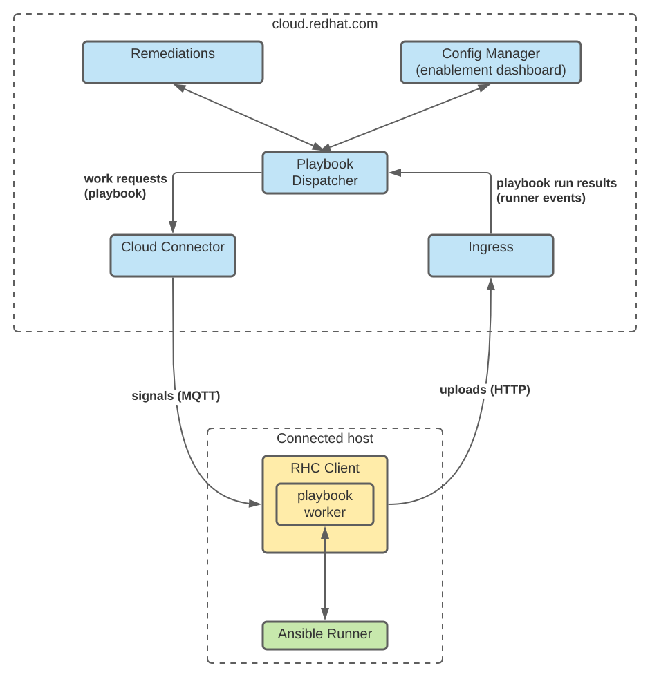
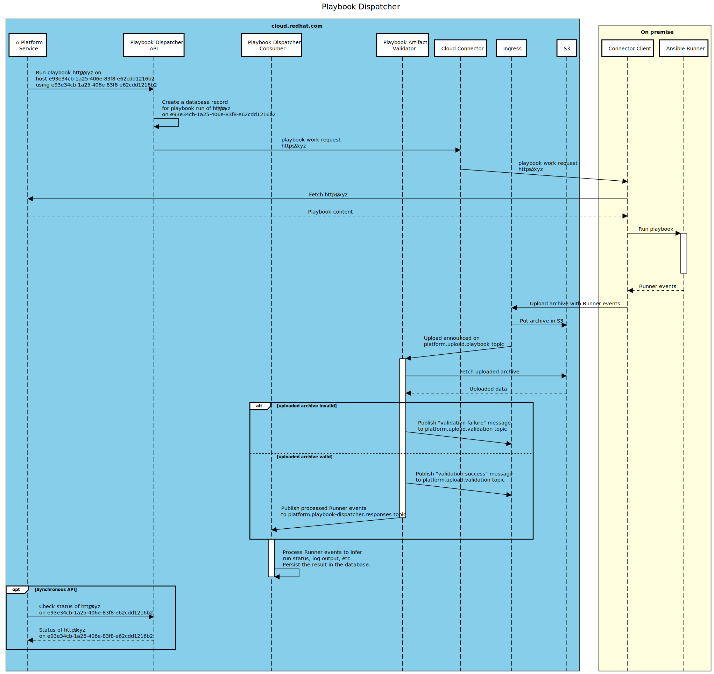

# Playbook Dispatcher

Playbook Dispatcher is a service for running Ansible Playbooks on hosts connected via [Cloud Connector](https://github.com/RedHatInsights/cloud-connector).

Playbook Dispatcher takes care of:

- dispatching the request to run a Playbook
- tracking the progress of a Playbook run



Playbook Dispatcher consists of 3 parts:

- API, which can be used to dispatch a Playbook or to query it's state
- validator, which validates archives uploaded via ingress service
- response consumer, which processes validated archives and updates the internal state accordingly



## Public REST interface

Information about Playbook runs can be queried using the [REST API](./schema/public.openapi.yaml).

### Filtering

The API offers rich filtering capabilities that enable resources to be filtered by their primary attributes as well as user-defined labels.

Examples:

- `/api/playbook-dispatcher/v1/runs?filter[status]=timeout` - filter runs based on the built-in `status` field
- `/api/playbook-dispatcher/v1/runs?filter[labels][state_id]=0fdeeaa3-44e7-459b-9c14-cee42ec39287` - filter runs based on a service-specific `state_id` label
- `/api/playbook-dispatcher/v1/run_hosts?filter[inventory_id]=e72d440b-0128-48fa-9bcc-b964eb8edab0` filter run hosts based on the given host inventory id

More information about supported filters can be found in the [API schema](https://github.com/RedHatInsights/playbook-dispatcher/blob/master/schema/public.openapi.yaml)

### Representations

The API supports client-specific representations using [sparse fieldsets](https://jsonapi.org/format/#fetching-sparse-fieldsets).
This allows the client to control which fields are returned in the response.
For example, the shape of the representation of the `/api/playbook-dispatcher/v1/runs` resource can be defined using:

```
/api/playbook-dispatcher/v1/runs?fields[data]=id,url,name
```

which yields

```json
{
  "data": [
    {
      "id": "5a9d54f5-06c2-46fe-a85e-dcc278cdce44",
      "url": "https://cert.cloud.redhat.com/api/config-manager/v1/states/99d4ff95-b2de-41c2-b717-f6261cc5e51b/playbook",
      "name": "Sample Playbook"
    }

// left out for brevity
```

More examples:

- `/api/playbook-dispatcher/v1/runs?fields[data]=id,labels,name,service`
- `/api/playbook-dispatcher/v1/run_hosts?fields[data]=host,status,stdout,links`

Default and available fields for each resource can be found in the [API schema](https://github.com/RedHatInsights/playbook-dispatcher/blob/master/schema/public.openapi.yaml)

### Authentication

The API is placed behind a [web gateway (3scale)](https://internal.cloud.redhat.com/docs/services/3scale/).
Authentication with the web gateway (basic auth, jwt cookie) is required to access the API.
The API is only accessible to principals of type User (i.e. cert auth is not sufficient).

For in-cluster access, a valid `x-rh-identity` header is required.

### Authorization

The API resources are subject to [role based access control](https://consoledot.pages.redhat.com/docs/dev/services/rbac.html).

The `playbook-dispatcher:run:read` permission is required to access the API.
The permission always defines an attribute filter which specifies which playbook runs the given principal is authorized to access.

For example, a principal granted the following permission:

```json
{
    "permission": "playbook-dispatcher:run:read",
    "resourceDefinitions": [
        {
            "attributeFilter": {
                "key": "service",
                "operation": "equal",
                "value": "remediations"
            }
        }
    ]
}
```

will have access to information about playbook runs initiated by the remediations service.

Information about playbook runs initiated by services for which the principal does not have the corresponding permission will be filtered out of API responses.

## Internal REST interface

In addition to the public REST interface, an internal REST interface is available.
This API can only be accessed from within the cluster where playbook-dispatcher is deployed.

In order to authenticate, the client is required to hold an app-specific pre-shared key and use it in HTTP requests in the `Authorization` header.

```
POST /internal/dispatch HTTP/1.1
Authorization: PSK <pre-shared key>
```

playbook-dispatcher supports multiple pre-shared keys to be configured at the same time.
The keys are configured via environment variables in form of `PSK_AUTH_<service id>=<pre-shared key>` where `service id` identifes the service that's been given the given key and `pre-shared key` is the key itself. For example:
```
PSK_AUTH_REMEDIATIONS=xwKhCUzgJ8 ./app run
```

### Dispatching of playbooks

Use the `/internal/v2/dispatch` operation to dispatch a playbook.

Sample request:
```
POST /internal/v2/dispatch
[
    {
        "recipient": "dd018b96-da04-4651-84d1-187fa5c23f6c",
        "org_id": "5318290",
        "url": "http://console.redhat.com/api/remediations/v1/remediations/ddf9196f-4df9-4c7d-9443-98a6f328e256/playbook",
        "name":"Apply fix",
        "principal": "jharting",
        "web_console_url": "http://console.redhat.com/insights/remediations/ddf9196f-4df9-4c7d-9443-98a6f328e256",
        "recipient_config": {
            "sat_id":"16372e6f-1c18-4cdb-b780-50ab4b88e74b",
            "sat_org_id":"6826"
        },
        "hosts": [
            {
                "inventory_id": "16372e6f-1c18-4cdb-b780-50ab4b88e74b",
                "ansible_host": "01.example.com"
            },
            {
                "inventory_id": "ed36792e-241d-4c12-a74a-a5adffbb436b",
                "ansible_host": "02.example.com"
            }
        ]
    }
]
```

In case of a recipient that's using `rhc-worker-playbook` (also known as "directly connected host") this can be reduced to:

```
POST /internal/v2/dispatch
[
    {
        "recipient": "dd018b96-da04-4651-84d1-187fa5c23f6c",
        "org_id": "5318290",
        "url": "http://console.redhat.com/api/remediations/v1/remediations/ddf9196f-4df9-4c7d-9443-98a6f328e256/playbook",
        "name":"Apply fix",
        "principal": "jharting",
        "web_console_url": "http://console.redhat.com/insights/remediations/ddf9196f-4df9-4c7d-9443-98a6f328e256"
    }
]
```

as the host is assumed implicitly and recipient config is not needed.

The `recipient` field contains the identifier that [Cloud Connector](https://github.com/RedHatInsights/cloud-connector) uses to route the signal.
Hosts that are using `rhc-worker-playbook` have their recipient identifier stored as [rhc_client_id in the system profile](https://github.com/RedHatInsights/inventory-schemas/blob/8000191d960da05c4ebf7960f4af8f7cf68bf616/schemas/system_profile/v1.yaml#L197). The recipient id of Satellite hosts can be obtained from [Sources](https://github.com/RedHatInsights/sources-api-go).

Both types of recipients can be used in a single dispatch operation.

See [API schema](./schema/private.openapi.yaml) for more details.

Sample response:
```
[
    {
        "code": 201,
        "id": "c7450666-5614-4826-9961-26c05968fece"
    }
]
```

### Canceling of playbooks

Use the `/internal/v2/cancel` operation to cancel a playbook.

Sample request:
```
POST /internal/v2/cancel
[
    {
        "run_id": "dd018b96-da04-4651-84d1-187fa5c23f6c",
        "org_id": "5318290",
        "principal": "jharting"
    }
]
```

Sample response:
```
[
    {
        "code": 202,
        "run_id": "dd018b96-da04-4651-84d1-187fa5c23f6c"
    }
]
```

See [API schema](./schema/private.openapi.yaml) for more details.

### Recipient status

One of the operations available in the internal API is the recipient status.
This operation allows the client to obtain connection information for a given set of recipients.

Sample request:
```
POST /internal/v2/recipients/status
[
    {
        "recipient": "35720ecb-bc23-4b06-a8cd-f0c264edf2c1",
        "org_id": "5318290"
    }, {
        "recipient": "73dca8b6-cc11-4954-8f6c-9ecc732ec212",
        "org_id": "5318290"
    }
]
```

Sample response:
```
[
    {
        "recipient": "35720ecb-bc23-4b06-a8cd-f0c264edf2c1",
        "org_id": "5318290",
        "connected": true
    }, {
        "recipient": "73dca8b6-cc11-4954-8f6c-9ecc732ec212",
        "org_id": "5318290",
        "connected": false
    }
]
```

See [API schema](./schema/private.openapi.yaml) for more details.

## Event interface

Services can integrate with Playbook Dispatcher by consuming its event interface.
Playbook Dispatcher emits an event for every state change.
These events are produced to `platform.playbook-dispatcher.runs` topic in Kafka from where integrating services can consume them.

The key of each event is the id of the given playbook run.

The value of each event is described by [a JSON schema](./schema/run.event.yaml).

```json
{
    "event_type": "create",
    "payload": {
      "id": "6555d6f7-8dc1-4dec-9d1e-0ef8a02d7d43",
      "account": "901578",
      "org_id": "5318290",
      "recipient": "dd018b96-da04-4651-84d1-187fa5c23f6c",
      "correlation_id": "fbf49ad9-ea79-41fb-9f6c-cb13307e993d",
      "service": "remediations",
      "url": "http://example.com",
      "labels": {
        "remediation_id": "1234"
      },
      "name": "Apply fix",
      "web_console_url": "http://example.com/remediations/1234",
      "recipient_config": {
        "sat_id": "16372e6f-1c18-4cdb-b780-50ab4b88e74b",
        "sat_org_id": "6826"
      },
      "status": "running",
      "timeout": 3600,
      "created_at": "2022-04-22T11:15:45.429294Z",
      "updated_at": "2022-04-22T11:15:45.429294Z"
    }
}
```


An event can be of type:

- create - when a new playbook run is created
- update - when the state of a playbook run changes
- delete - when a playbook run is removed
- read - special type of event used to re-populate the topic (i.e. to remind the consumers of the latest state of a given run). This event does not indicate state change but can be used to populate caches, etc.

In addition, each event contains the following headers:

- `event_type` - the type of the event (see above)
- `service` - the service that created the given playbook run
- `status` - current of the playbook run
- `account` - a legacy identifier for the account (tenant) the given playbook run belong to (replaced by `org_id`)
- `org_id` - the account (tenant) the given playbook run belong to

The event headers make it possible to filter events without the need to parse the value of each event.

## Expected input format

The service expects the uploaded files to be in one of the two supported formats.

### Ansible Runner events

The uploaded file contains Ansible Runner [job events](https://ansible-runner.readthedocs.io/en/stable/intro.html#runner-artifact-job-events-host-and-playbook-events).
Job events should be stored in the [newline-delimited JSON](https://jsonlines.org/) format.
Each line in the file matches one job event.

```jsonl
{"event": "executor_on_start", "uuid": "4533e4d7-5034-4baf-b578-821305c96da4", "counter": -1, "stdout": "", "start_line": 0, "end_line": 0, "event_data": {"dispatcher_correlation_id": "c37278ac-f41c-424a-8461-7f41b4b87c8e"}}
{"event": "playbook_on_start", "uuid": "cb93301e-5ff8-4f75-ade6-57d0ec2fc662", "counter": 0, "stdout": "", "start_line": 0, "end_line": 0}
{"event": "playbook_on_stats", "uuid": "998a4bd2-2d6b-4c31-905c-2d5ad7a7f8ab", "counter": 1, "stdout": "", "start_line": 0, "end_line": 0}
```

The structure of each event is validated using a JSON Schema defined in [ansibleRunnerJobEvent.yaml](./schema/ansibleRunnerJobEvent.yaml).
Note that additional attributes (not defined by the schema) are allowed.

For plain files, the expected content type of the uploaded file is `application/vnd.redhat.playbook.v1+jsonl`.
For compressed files, the expected content type of the uploaded file is `application/vnd.redhat.playbook.v1+gzip` for gzip compressed files and `application/vnd.redhat.playbook.v1+xz` for xz compressed files.

#### Non-standard event types

Besides Ansible Runner event types (`playbook_*` and `runner_*`) the services recognizes two additional event types.

Firstly, `executor_on_start` event type is produced before Ansible Runner is invoked.

```json
{"event": "executor_on_start", "uuid": "4533e4d7-5034-4baf-b578-821305c96da4", "counter": -1, "stdout": "", "start_line": 0, "end_line": 0, "event_data": {
    "crc_dispatcher_correlation_id": "c37278ac-f41c-424a-8461-7f41b4b87c8e"
}}
```

The event carries the correlation id in the `event_data` dictionary.
This identifier is necessary to tie the uploaded file to a Playbook run.

Secondly, `executor_on_failed` event type may be produced should it not be possible to start a Playbook run for some reason.
This may happen e.g. if the Playbook signature is not valid, Ansible Runner binary is not available/executable, etc.

```json
{"event": "executor_on_failed", "uuid": "14f07467-0020-4ab7-a075-d7d8c96d6fdc", "counter": -1, "stdout": "", "start_line": 0, "end_line": 0, "event_data": {
    "crc_dispatcher_correlation_id": "c37278ac-f41c-424a-8461-7f41b4b87c8e",
    "crc_dispatcher_error_code": "SIGNATURE_INVALID",
    "crc_dispatcher_error_details": "Signature \"783701f7599830824fa73488f80eb79894f6f14203264b6a3ac3f0a14012c25f\" is not valid for Play \"run insights to obtain latest diagnosis info\"",
}}
```

Again, the correlation id is defined.
In addition, an error code and detailed information should be provided.

### Satellite Events

In addition to Ansible Runner events, playbook-dispatcher also supports events produced by satellite. Similar to Ansible Runner events, these events from satellite should be stored in newline-delimited JSON, and should match the Satellite [job events schema](https://github.com/RedHatInsights/playbook-dispatcher/blob/master/schema/rhcsatJobEvent.yaml).

```jsonl
{"type": "playbook_run_update", "version": 3, "correlation_id": "0465783c-2e36-4e57-8514-c2cb962d323a", "sequence": 0, "host": "0e4eac4a-e303-4c83-9f6b-2152d4cfa242", "console": "host1"}
{"type": "playbook_run_finished", "version": 3, "correlation_id": "0465783c-2e36-4e57-8514-c2cb962d323a", "host": "0e4eac4a-e303-4c83-9f6b-2152d4cfa242", "status": "success", "connection_code": 0, "execution_code": 0}
{"type": "playbook_run_update", "version": 3, "correlation_id": "0465783c-2e36-4e57-8514-c2cb962d323a", "sequence": 4, "host": "e8f05d27-5af9-4547-a30c-5be04e099ffe", "console": "host2"}
{"type": "playbook_run_finished", "version": 3, "correlation_id": "0465783c-2e36-4e57-8514-c2cb962d323a", "host": "e8f05d27-5af9-4547-a30c-5be04e099ffe", "status": "success", "connection_code": 0, "execution_code": 0}
{"type": "playbook_run_completed", "version": 3, "correlation_id": "0465783c-2e36-4e57-8514-c2cb962d323a", "status": "success", "satellite_connection_code": 0, "satellite_infrastructure_code": 0}
```

`playbook_run_update` and `playbook_run_finished` events are bound to hosts, while `playbook_run_completed` events are bound to playbook runs and are sent out only once after the playbook run has concluded on all involved hosts. The `sequence` and `console` fields are not mandatory for `playbook_run_finished` and `playbook_run_completed` events.

The content type of plain files of uploads need to be `application/vnd.redhat.playbook-sat.v3+jsonl`. For compressed files, the content type is expected to be either `application/vnd.redhat.playbook-sat.v3+gzip` or `application/vnd.redhat.playbook-sat.v3+xz`.

#### Partial Satellite Response

When playbook-dispatcher is deployed with `response_full` set to `false`, updates from all hosts involved in a playbook run are not expected with each upload. Satellite do not need to provide the entire console log with each update from a host, instead, they can provide the difference relative to the last `playbook_run_update` from a host and playbook-dispatcher will concatenate these logs and record it in the database.

## Cloud Connector integration

Playbook Dispatcher uses [Cloud Connector](https://github.com/RedHatInsights/cloud-connector) to invoke Playbooks on connected hosts.
Depending on the type of RHC worker used on the recipient, the message will be in one of the following formats.

### rhc-worker-playbook

For each Playbook run request a message with the following format is sent to Cloud Connector:

```javascript
{
    "account":"540155",
    "directive":"rhc-worker-playbook",
    "recipient":"869fe355-4b69-43f6-82ff-d151dddee472", // id of the cloud connector client
    "metadata":{
        "crc_dispatcher_correlation_id":"e957564e-b823-4047-9ad7-0277dc61c88f", // see Non-standard event types for more details
        "response_interval":"600", // how often the recipient should send back responses
        "return_url":"https://cloud.redhat.com/api/ingress/v1/upload" // URL to post responses to
    },
    // playbook to execute
    "payload": "https://cloud.redhat.com/api/v1/remediations/1234/playbook?hosts=8f876606-5289-47f7-bb65-3966f0ba3ae1"
}
```

See [rhc-worker-playbook](https://github.com/RedHatInsights/rhc-worker-playbook) for details.

### foreman_rh_cloud

For each Playbook run request a message with the following format is sent to Cloud Connector:

```javascript
    "account":"540155",
    "directive":"foreman_rh_cloud",
    "recipient":"869fe355-4b69-43f6-82ff-d151dddee472", // id of the cloud connector client
    "metadata":{
        "operation": "run",
        // URL to post responses to
        "return_url":"https://cloud.redhat.com/api/ingress/v1/upload"
        // identifier used to correlate the initial signal with response data messages
        "correlation_id": "e957564e-b823-4047-9ad7-0277dc61c88f",
        // human-readable name of the playbook run
        "playbook_run_name": "Human-readable playbook run name",
        // URL that the user can be redirected to for more information about the playbook run
        "playbook_run_url": "https://console.redhat.com/insights/remediations/1234",
        // identifier of the Satellite instance
        "sat_id": "aa3b1faa-56f3-4d14-8258-615d11e20060",
        // identifier of the organization within Satellite
        "sat_org_id": "12345",
        // the SHA-256 hash of the username of the user that initiated the playbook run. May be empty string if the playbook is not initiated by a user
        "initiator_user_id": "4efca34c6d9ae05ef7c3d7a7424e6370d198159a841ae005084888a9a4529e27",
        // the list of hosts (their host inventory identifiers as defined by host-inventory service) involved in the playbook run
        "hosts": "4df562cb-596c-4f2b-9ed1-ff2e920706c5,b562a345-dba5-4f77-a7c9-a4e5ddb4a61a",
        // how often the recipient should send back responses
        "response_interval": "30",
        // indicates whether the playbook run update data message should contain the full console output (true) or only the diff relative to the previous playbook run update message sent for the given host (false)
        "response_full": "false"
    },
    // playbook to execute
    "payload": "https://cloud.redhat.com/api/v1/remediations/1234/playbook"
```

See [foreman_rh_cloud](https://github.com/ShimShtein/foreman_rh_cloud) for details.

## Development

### Prerequisities

- Golang >= 1.14
- golangci-lint
- docker-compose

### Running the service

Run `docker-compose up --build` to start the service and its dependencies

The API can be accessed at <http://localhost:8000/api/playbook-dispatcher/v1/runs>

```sh
curl -v -H "x-rh-identity: eyJpZGVudGl0eSI6eyJpbnRlcm5hbCI6eyJvcmdfaWQiOiI1MzE4MjkwIn0sImFjY291bnRfbnVtYmVyIjoiOTAxNTc4IiwidXNlciI6e30sInR5cGUiOiJVc2VyIn19Cg==" http://localhost:8000/api/playbook-dispatcher/v1/runs
```

#### Inspecting the event interface

1. Download and unpack [Kafka](https://kafka.apache.org/downloads)

1. Start kafka-console-consumer configured to consume the event interface topic

    `/bin/kafka-console-consumer.sh --bootstrap-server=localhost:29092 --from-beginning --topic platform.playbook-dispatcher.runs`

1. Trigger a state change (e.g. `make sample_request_sat`)

Useful commands:

- `make sample_request` can be used to dispatch a new sample Playbook
- `make sample_upload` can be used to upload a sample archive via Ingress

### Running tests

`make test`

### Running linter

install and run linter
`make run-lint`
